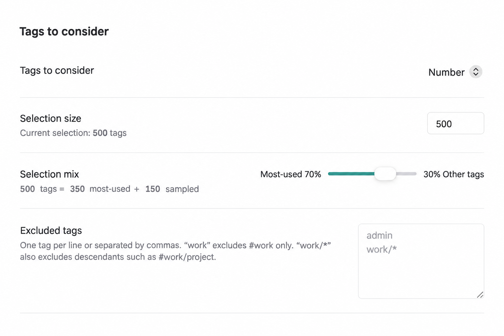
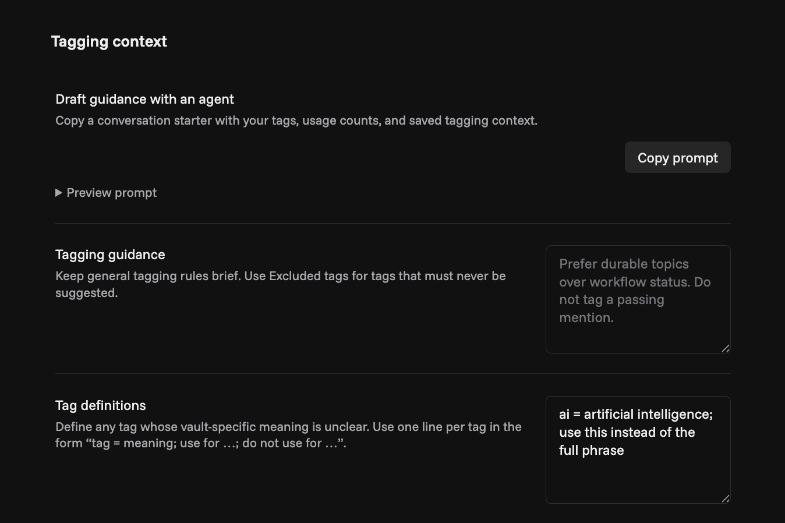

# Tag Match

Tag Match finds relevant tags among those in your Obsidian vault for a given note. It uses an AI decision model to judge each candidate against your note, optionally using tagging rules and definitions you provide. You can review its suggestions or add top matches directly.

## AI models

Tag Match uses Jev through [TypeSafe](https://typesafe.ai/) or [OpenRouter](https://openrouter.ai/). Analysis requires an account, an API key, and paid API credits with either provider.

## Features

- **Matches your tag system.** Shape which tags fit a note using natural-language definitions and rules.
- **Fast, low-cost matching.** Jev evaluates tags in batches and gives each a match probability. Several tags can qualify for one note without generating a long-form response.
- **Fine-grained controls.** Choose how many tags to check and balance the most-used with less-used ones, so newer or forgotten tags still get considered. Exclude tags or branches, set a minimum score and addition limit, then review or apply matches directly.
- **Fits existing agent workflows.** Your AI agents can tag notes with the same preferences and provider connections you use in Obsidian. The optional CLI supports review, direct application, and other decision tasks.





## Getting started

You need Obsidian 1.13.0 or later and a TypeSafe or OpenRouter API key.

1. [Install Tag Match from Community plugins](https://community.obsidian.md/plugins/tag-match), or open **Settings → Community plugins → Browse** in Obsidian and search for **Tag Match**. Enable it after installing.
2. In Tag Match settings, choose TypeSafe or OpenRouter and create or select an Obsidian Secret containing its API key. Enter the key on each device you use; Obsidian does not sync secret values.
3. Open a Markdown note and run **Tag Match: Review tags for current note** to analyze and choose matches before adding them, or **Tag Match: Add recommended tags to current note** to analyze and add them directly.

Both commands respect your exclusions and maximum additions, and refuse to apply an analysis if the note has changed.

The plugin uses Obsidian APIs available on desktop and mobile. The companion CLI requires a computer with Node.js 22 or later.

### Manual installation

Download `main.js`, `manifest.json`, and `styles.css` from the [latest release](https://github.com/nweii/tag-match/releases/latest). Put them in `<vault>/.obsidian/plugins/tag-match/`, reload Obsidian, and enable Tag Match under **Settings → Community plugins**.

## How Tag Match chooses tags

### Tags to consider

**Tags to consider** sets the size of the candidate pool. Choose the default, a specific number or percentage, or **All tags**. A larger pool can find more matches, but can take longer and use more API credits.

When the pool is limited, **Selection mix** divides it between your most-used tags and a sample of the rest. You can change that balance. The sample varies between notes, giving newer and forgotten tags a chance without checking your entire vocabulary every time.

### Suggestions and tagging context

Tag Match chooses candidate tags locally, then Jev judges each one against the note. Each tag gets its own probability, so several can match the same note.

**Minimum match score** and **Maximum tags to add** control which matches are preselected for review or added directly. Raise the score or lower the limit for a more selective result. You can change the selection in review mode before adding tags.

Use short rules for general guidance, such as “Tag substantial topics; skip passing mentions.” Give individual tags a definition when your use differs from their ordinary meaning:

```text
dev = Building, debugging, or maintaining software; include implementation tutorials; exclude general technology news without development content.
```

Use **Excluded tags** for firm exclusions: `admin` excludes that tag; `work/*` excludes `work` and its descendants. Guidance influences the model's judgment; exclusions and addition limits are enforced by the plugin.

Long notes are sampled from the beginning, middle, and end within your text limit. The review shows how many tags will be considered and whether the note was sampled before analysis.

## Agents and scripts

Agents can use Tag Match through a companion Node CLI. It shares the plugin's saved provider, model, tagging preferences, and Obsidian Secret reference. The CLI reads the Secret while that vault is open in Obsidian; an environment variable can supply the key when Obsidian is closed.

On desktop, choose **Copy install command** in Tag Match settings and run it in a terminal. It installs the optional CLI and agent guide beside the plugin without copying credentials. Reload Tag Match afterward. Obsidian updates the plugin separately; settings offers an optional CLI update when a newer version is available.

Use **Copy agent instruction** in Tag Match settings to point an agent to the installed guide. The CLI's `--help` documents its commands and inputs. See the [agent guide](./docs/agent-cli.md) for review and direct-apply workflows, and for obtaining the vault's tag inventory.

An agent can combine `preview`, `suggest`, `review`, and `apply`, or use `quick-apply` for direct application. `evaluate` exposes general decision questions. The CLI can run without Obsidian when the caller supplies the tag inventory and existing tags.

## Privacy and network access

Analysis sends the note title, description, existing tags, selected body text, candidate tags, tagging guidance, and relevant tag definitions to your chosen service: `api.typesafe.ai` or `openrouter.ai`. With OpenRouter, requests are routed to the model provider. Analysis starts only when you invoke it; there is no background vault scan sent to a model.

API keys stay in Obsidian Secrets on the device where you enter them. The plugin's `data.json` stores only the selected secret's name; synced settings may carry that name to another device, but not the key. Tag Match has no client-side telemetry. Provider data handling follows [TypeSafe's privacy policy](https://typesafe.ai/legal/privacy-policy) and, when selected, [OpenRouter's privacy policy](https://openrouter.ai/privacy).

Copy buttons write to the system clipboard only when clicked; Tag Match never reads it.

The Obsidian plugin operates within your vault. The optional CLI reads its explicit configuration path and can read or modify a Markdown file outside a vault when you supply that path. It does not search your filesystem for notes or credentials.

## About

Tag Match is an independent project by [Nathan Cheng](https://nathancheng.work/). It is not affiliated with Obsidian, TypeSafe, or OpenRouter.

[Report a bug](https://github.com/nweii/tag-match/issues/new/choose) · [Security policy](./SECURITY.md) · [Third-party notices](./THIRD_PARTY_NOTICES.md) · [Buy me a coffee](https://buymeacoffee.com/nthnwei)
