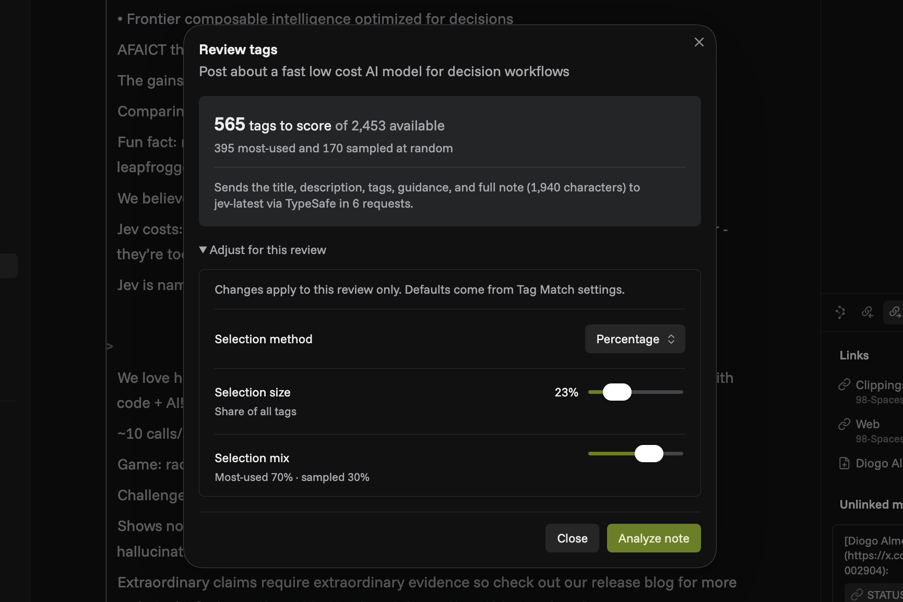

# Tag Match

Tag Match finds relevant tags for one or more notes in your Obsidian vault. Use your existing tags or provide a specific set, including tags you haven't used yet. It uses an AI decision model to judge which tags fit each note, optionally using tagging rules and definitions you provide. You can review suggestions for an individual note or add top matches directly to one note or a whole batch.

## AI models

Tag Match uses Jev through [TypeSafe](https://typesafe.ai/) or [OpenRouter](https://openrouter.ai/). Analysis requires an account, an API key, and paid API credits with either provider.

## Features

- **Matches your tag system.** Shape which tags fit a note using natural-language definitions and rules.
- **Fast, low-cost matching.** Decision models like Jev evaluate quickly rather than generating prose like a general-purpose LLM. Tag Match uses those per-tag judgments to consider more of your vocabulary at low cost, while taking the note and your tagging guidance into account.
- **Fine-grained controls.** Choose how many tags to check and balance the most-used with less-used ones, so newer or forgotten tags still get considered. Exclude tags or branches, set a minimum score and addition limit, then review or apply matches directly.
- **Use existing tags or a specific set.** Reuse your vault's vocabulary or use "Only these tags" to supply the tags you want considered. Each tag is evaluated independently against each note, so you can apply a specific set wherever it fits.
- **Bulk tagging.** Select individual notes, folders, or a mix of both. Adjust settings for that batch and keep working while tagging runs in the background. It's easy to check progress and results, and undo additions if needed.
- **Fits existing agent workflows.** Your AI agents can tag notes with the same preferences and provider connections you use in Obsidian. The optional CLI lets agents review matches or add them directly.




## Getting started

You need Obsidian 1.13.0 or later and a TypeSafe or OpenRouter API key.

1. [Install Tag Match from Community plugins](https://community.obsidian.md/plugins/tag-match), or open **Settings → Community plugins → Browse** in Obsidian and search for **Tag Match**. Enable it after installing.
2. In Tag Match settings, choose TypeSafe or OpenRouter and create or select an Obsidian Secret containing its API key. Enter the key on each device you use; Obsidian does not sync secret values.
3. Open a Markdown note and run **Tag Match: Suggest tags for current note…** to analyze and choose matches before adding them, or **Tag Match: Match and add tags to current note** to analyze and add them directly.

Both commands use your tag selection settings and refuse to apply results if the note has changed.

### Tag multiple notes

Run **Tag Match: Match tags to multiple notes…**, or use the tag-matching action in the context menu for selected files or folders in Obsidian's file explorer.

Select notes or folders and use **Show selected** to check the batch. **Add tags to N notes** analyzes and adds matches directly. **Adjust for this batch** overrides your defaults for that run.

Use **Run in background** to keep working. Reopen progress and results through the notice, desktop status bar, or **Tag Match: Show bulk tagging progress** command. **Stop** cancels remaining work; requests already running may still use credits.

Results show additions, skipped notes, and failures. **Undo additions** restores notes that haven't changed since tagging. Undo remains available until you close completed results, reload the plugin, or quit Obsidian.

### Manual installation

Download `main.js`, `manifest.json`, and `styles.css` from the [latest release](https://github.com/nweii/tag-match/releases/latest). Put them in `<vault>/.obsidian/plugins/tag-match/`, reload Obsidian, and enable Tag Match under **Settings → Community plugins**.

## How Tag Match chooses tags

### Tags to consider

Choose **Only these tags** in **Selection method** to score a specific set, including tags not yet used in the vault. This replaces vault selection, sampling, and exclusions. Other selection methods use vault tags and allow **Excluded tags** to remove specific tags or branches (`work/*`). You can override the saved defaults under **Adjust for this review** or **Adjust for this batch**. Tags already on a note are skipped in either mode.

**Selection method** sets how the candidate pool is chosen when using vault tags. Choose the default, a specific number or percentage, or **All tags**. A larger pool can find more matches, but can take longer and use more API credits.

When the pool is limited, **Selection mix** divides it between your most-used tags and a sample of the rest. You can change that balance. The sample varies between notes, giving newer and forgotten tags a chance without checking your entire vocabulary every time. After a review, **Score more tags** draws another random sample of the same size from tags that haven't been scored yet.

### Suggestions and tagging context

Tag Match chooses candidate tags locally, then asks the decision model to estimate the probability that each tag belongs on the note. It considers the note's title, description, sampled body, existing tags, and your general guidance alongside each candidate tag, its definition if you provided one, and criteria for a meaningful match. Because tags are evaluated independently, several can qualify for the same note.

Tag Match ranks those probabilities. **Minimum match score** sets how strong a match must be, while **Maximum tags to add** limits how many are preselected for review or added directly. You can change the selection in review mode before adding tags.

Use short rules for general guidance, such as “Tag substantial topics; skip passing mentions.” Give individual tags a definition when your use differs from their ordinary meaning:

```text
dev = Building, debugging, or maintaining software; include implementation tutorials; exclude general technology news without development content.
```

When using vault tags, use **Excluded tags** for firm exclusions: `admin` excludes that tag; `work/*` excludes `work` and its descendants. Guidance influences the model's judgment; exclusions are enforced by the plugin. **Only these tags** uses your explicit set instead of exclusions.

Long notes are sampled from the beginning, middle, and end within your text limit. The review shows how many tags will be considered and whether the note was sampled before analysis.

## Agents and scripts

Agents can use Tag Match through a companion Node CLI. It shares the plugin's saved provider, model, tagging preferences, and Obsidian Secret reference. The CLI reads the Secret while that vault is open in Obsidian; an environment variable can supply the key when Obsidian is closed.

On desktop, choose **Copy install command** in Tag Match settings and run it in a terminal. It installs the optional CLI and agent guide beside the plugin without copying credentials. Choose **Check CLI status** in settings afterward. Obsidian updates the plugin separately; Tag Match checks whether the installed CLI build matches the companion build for this plugin and offers an optional update when they differ.

Use **Copy agent instruction** in Tag Match settings to point an agent to the installed guide. The CLI's `--help` documents its commands and inputs. See the [agent guide](./docs/agent-cli.md) for review and direct-apply workflows, and for obtaining the vault's tag inventory.

An agent can combine `preview`, `suggest`, `review`, and `apply`, or use `quick-apply` for direct application. The CLI can run without Obsidian when the caller supplies the tag inventory and existing tags.

The CLI also supports bulk tagging of selected notes and folders. `bulk` defaults to a dry run without API calls or note changes. `--suggest` returns review plans, and `--apply --recovery PATH` adds matches with durable undo. Up to three notes run in parallel, with per-note results and cancellation.

`bulk-undo` previews or restores additions while preserving later edits. Single-note and bulk commands accept per-run overrides, including `--only-tags`, without changing saved settings. See the [agent guide](./docs/agent-cli.md#bulk-tagging) for inputs and examples.

## Privacy and network access

Analysis sends the note title, description, existing tags, selected body text, candidate tags, tagging guidance, and relevant tag definitions to your chosen service: `api.typesafe.ai` or `openrouter.ai`. With OpenRouter, requests are routed to the model provider. Analysis starts only when you invoke it; there is no background vault scan sent to a model.

API keys stay in Obsidian Secrets on the device where you enter them. The plugin's `data.json` stores only the selected secret's name; synced settings may carry that name to another device, but not the key. Tag Match has no client-side telemetry. Provider data handling follows [TypeSafe's privacy policy](https://typesafe.ai/legal/privacy-policy) and, when selected, [OpenRouter's privacy policy](https://openrouter.ai/privacy).

Copy buttons write to the system clipboard only when clicked; Tag Match never reads it.

The Obsidian plugin operates within your vault. The optional CLI reads its explicit configuration path and can read or modify a Markdown file outside a vault when you supply that path. It does not search your filesystem for notes or credentials.

## About

Tag Match is an independent project by [Nathan Cheng](https://nathancheng.work/). It is not affiliated with Obsidian, TypeSafe, or OpenRouter.

[Report a bug](https://github.com/nweii/tag-match/issues/new/choose) · [Security policy](./SECURITY.md) · [Third-party notices](./THIRD_PARTY_NOTICES.md) · [Buy me a coffee](https://buymeacoffee.com/nthnwei)
